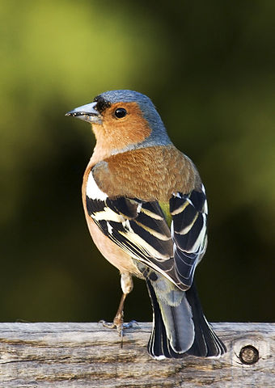

Finch
=====

Reports test data results gathered from a Jenkins server by [Scout](https://github.com/omaciel/scout).

Example
-------

Generate a Comma Separated Value (CSV) file using data collected from a Jenkins server using the following format:

```
[Chart Title],[Category1],[Category2],[Category3]
[date],[passed],[failed],[skipped]
[date],[passed],[failed],[skipped]
[date],[passed],[failed],[skipped]
```

[Live demo](http://omaciel.github.io/finch/index.html).

* Finch's image is a file from the [Wikimedia Commons](https://commons.wikimedia.org/wiki/Main_Page). Information from its [description page](https://commons.wikimedia.org/wiki/File:Fringilla_coelebs_chaffinch_male_edit2.jpg) there is shown below. 
Commons is a freely licensed media file repository. [You can help](https://commons.wikimedia.org/wiki/Commons:Welcome).*